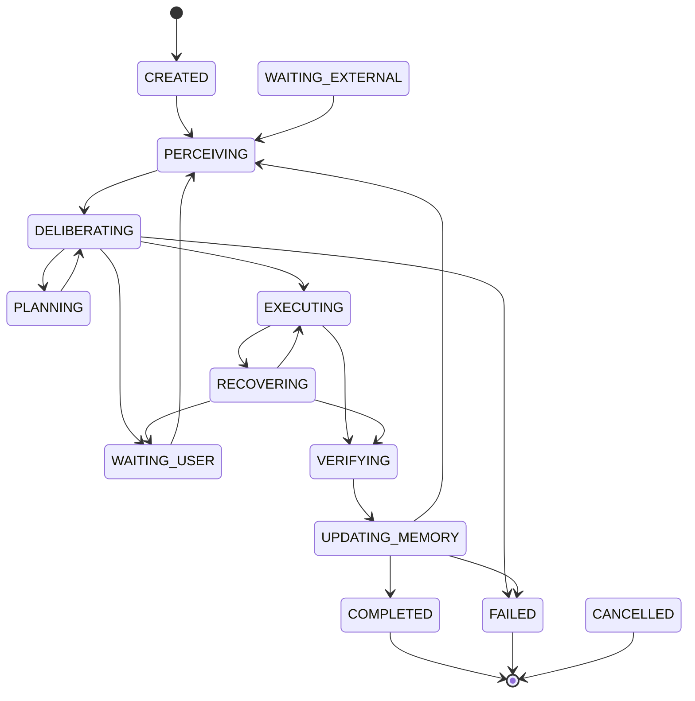

# NeuroLoop — Especificação de Engenharia do MVP

## 1. Interpretação da arquitetura

O sistema não deve simular biologicamente um cérebro. As metáforas cognitivas viram responsabilidades concretas de software:

- Global Workspace → `WorkingContext`, projeção limitada do estado atual.
- Executive Controller → policy engine determinístico + deliberador estruturado por LLM.
- Fast Path → execução de skill/procedimento já conhecido sem novo planejamento.
- Slow Path → planejamento incremental e replanning.
- Memória episódica → registros estruturados de decisões, ações, resultados e verificações.
- Memória semântica → fatos persistentes com proveniência, somente após V0.
- Memória procedural → skills versionadas.
- Drives → variáveis computáveis como urgência, risco, custo e pressão de budget.
- Consolidação → job que resume episódios e, futuramente, promove fatos/skills.

Princípio arquitetural: **o LLM não é o agente**. O agente é o runtime formado por estado, regras, memória, tools, verificação, limites e um LLM usado somente onde acrescenta capacidade.

Fluxo:

```text
EVENTO → PERCEPÇÃO → CHECKPOINT/ESTADO → CONTEXTO → CONTROLLER
      → FAST PATH ou PLAN → ACTION PROPOSAL → POLICY → EXECUTOR
      → OBSERVAÇÃO DO EFEITO → VERIFIER → MEMÓRIA/ESTADO → próximo ciclo
```

## 2. Hipótese que o MVP precisa provar

> Um runtime controlado por estado, com LLM limitado às decisões ambíguas, consegue executar tarefas compostas, recuperar-se de erros e verificar objetivamente resultados com menos falsos sucessos do que um agente `LLM → tool → LLM` convencional.

Sub-hipóteses:

- **H1 Continuidade:** persistência permite retomar tarefas após erro, pausa ou restart.
- **H2 Verificação:** separar tool success de goal success reduz `false_success_rate`.
- **H3 Reutilização:** episódios e skills reduzem ciclos/tool calls em tarefas semelhantes sem reduzir sucesso.

## 3. Gaps encontrados

| Gap | Decisão V0 |
|---|---|
| Loop contínuo ou event-driven? | Event-driven; roda ciclos até concluir, bloquear, esperar ou falhar |
| Tick? | Não |
| Scheduler? | Não |
| Objetivos concorrentes? | Não; 1 root goal por run |
| Subobjetivos? | `PlanStep`, não outro `Goal` |
| Workspace persistente? | Não; projeção derivada |
| Controller | Híbrido: gates determinísticos + LLM somente quando necessário |
| Fast Path aprende sozinho? | Não |
| Planejamento longo? | Não; horizonte curto |
| Retry de side effect | Só com idempotência ou prova de ausência do efeito |
| Timeout = falha? | Não; pode ser `UNKNOWN_EFFECT` |
| Verifier via LLM? | Último recurso |
| Embeddings | Não inicialmente |
| Semantic memory | V0.5 |
| Skill synthesis | V1 |
| Event sourcing | Não |
| Subagentes | Não |
| Queue/microservices | Não |
| Crash durante side effect | `RECOVERING`; observar antes de repetir |
| Concorrência | lock por `run_id` + optimistic `state_version` |
| Conclusão | decidida pelo Verifier |

### Regra crítica de retry

```text
timeout != action_failed
```

Para side effects:

```text
timeout → UNKNOWN_EFFECT → probe estado externo
    ├─ efeito confirmado → SUCCESS
    ├─ efeito ausente + idempotente → RETRY
    └─ impossível determinar → WAITING_USER
```

## 4. Simplificações recomendadas

A V0 será um **modular monolith**:

- um processo para API + runtime + módulos cognitivos;
- um root goal por run;
- PlanSteps em vez de árvore de Goals;
- sem tabela própria para workspace;
- skills cadastradas manualmente;
- sem semantic memory na V0;
- sem skill learning automático;
- consolidação = resumo de run;
- sem vector DB, Redis, queue, LangGraph, subagentes ou scheduler autônomo.

## 5. Arquitetura final do MVP

```text
Client/API
   │
   ▼
Goal / Resume
   │
   ▼
┌──────────────── AGENT RUNTIME ────────────────┐
│ Perception → Run State / Working Context      │
│                    │                          │
│                    ▼                          │
│            Executive Controller               │
│                 │        │                    │
│                 ▼        ▼                    │
│            Fast Path   Deliberator/Planner    │
│                 └──────┬───────┘              │
│                        ▼                      │
│                 Action Proposal               │
│                        ▼                      │
│                 Safety / Policy               │
│                        ▼                      │
│                    Executor                   │
│                        ▼                      │
│                    Verifier                   │
│                  ┌─────┴─────┐                │
│                  ▼           ▼                │
│             State Update  Episode Store       │
└──────────────────┬────────────┬───────────────┘
                   ▼            ▼
              PostgreSQL     Tool Adapters
```

## 6. Responsabilidade dos componentes

| Componente | Responsabilidade |
|---|---|
| `AgentRuntime` | dirigir a state machine |
| `PerceptionNormalizer` | converter entradas em `Observation` |
| `GoalService` | criar/concluir/cancelar Goal |
| `WorkspaceBuilder` | selecionar contexto relevante |
| `MemoryRetriever` | buscar episódios relacionados |
| `ExecutiveController` | gates e roteamento |
| `FastPath` | localizar skill/step executável |
| `Deliberator` | ACT / PLAN / ASK_USER / IMPOSSIBLE |
| `PlannerValidator` | validar plano gerado |
| `PolicyEngine` | permissões, risco, aprovação |
| `ToolRegistry` | catálogo tipado de tools |
| `Executor` | executar e registrar attempts |
| `Verifier` | verificar execução, estado, goal e safety |
| `EpisodeStore` | persistir experiência resumida |
| `TraceRecorder` | auditoria, tracing e métricas |

Regra estrutural:

```text
Executor não decide.
Planner não executa.
Verifier não planeja.
LLM não autoriza.
```

## 7. Agent loop

```python
async def run_until_pause(run_id):
    async with acquire_run_lock(run_id):
        run = await runs.load(run_id)
        goal = await goals.load(run.goal_id)

        while True:
            run = await runs.reload(run_id)

            if run.cancel_requested:
                return await cancel_run(run)
            if limits_exceeded(run):
                return await fail_run(run, "BUDGET_EXCEEDED")
            if run.iteration >= run.max_iterations:
                return await fail_run(run, "LOOP_LIMIT")

            transition(run, PERCEIVING)
            observations = await perception.collect_pending(run)
            memories = await memory.retrieve(goal, run, observations, limit=5)
            context = workspace.build(goal, run, observations, memories, await plans.active(run.id))
            await checkpoint(run, context)

            completion = await verifier.verify_goal_if_possible(goal, context)
            if completion.satisfied:
                return await complete_run(run, completion)

            transition(run, DELIBERATING)
            gate = policy.pre_decision(run, goal, context)
            if gate.type == "STOP":
                return await fail_run(run, gate.reason)
            if gate.type == "WAIT_USER":
                return await wait_for_user(run, gate.request)

            candidate = fast_path.match(context)
            decision = (
                ActDecision(source="FAST_PATH", action=candidate.action)
                if candidate
                else await deliberator.decide(context)
            )

            if decision.type == "ASK_USER":
                return await wait_for_user(run, decision.request)
            if decision.type == "IMPOSSIBLE":
                return await fail_run(run, "IMPOSSIBLE_TASK", decision.evidence)
            if decision.type == "PLAN":
                plan = planner_validator.validate(decision.plan)
                await plans.replace_active(run.id, plan)
                run.replan_count += 1
                if run.replan_count > run.max_replans:
                    return await fail_run(run, "REPLAN_LIMIT")
                await checkpoint(run)
                continue

            action = decision.action
            authorization = policy.authorize(action, context)
            if authorization.requires_user_approval:
                return await wait_for_user(run, ApprovalRequest.from_action(action))
            if not authorization.allowed:
                return await fail_run(run, "PERMISSION_DENIED")

            action_record = await actions.create_logical_action(
                run_id=run.id,
                action=action,
                idempotency_key=make_idempotency_key(run, action),
            )

            transition(run, EXECUTING)
            try:
                result = await executor.execute(action_record, timeout=action.timeout_seconds)
            except DefiniteToolFailure as error:
                result = ToolResult.failed(error)
            except AmbiguousSideEffectTimeout as error:
                result = ToolResult.unknown_effect(error)

            transition(run, VERIFYING)
            verification = await verifier.evaluate(goal, action_record, result, context)

            transition(run, UPDATING_MEMORY)
            await episodes.record(run, context, decision, action_record, verification)
            run.iteration += 1
            await checkpoint(run)

            match verification.next_action:
                case "CONTINUE": continue
                case "GOAL_COMPLETED": return await complete_run(run, verification)
                case "RETRY":
                    if executor.retry_is_safe(action_record):
                        await schedule_retry_same_action(action_record)
                        continue
                    return await wait_for_user(run, reason="RETRY_NOT_PROVABLY_SAFE")
                case "REPLAN":
                    await plans.invalidate_active(run.id)
                    continue
                case "ASK_USER": return await wait_for_user(run, verification.request)
                case "STOP_FAILURE": return await fail_run(run, verification.error_code)
```

Nunca manter transação PostgreSQL aberta durante chamada externa.

## 8. State machine

Estados:

```text
CREATED
PERCEIVING
DELIBERATING
PLANNING
EXECUTING
VERIFYING
UPDATING_MEMORY
RECOVERING
WAITING_USER
WAITING_EXTERNAL
BLOCKED
COMPLETED
FAILED
CANCELLED
```



## 9. Global Workspace / Agent State

Persistente:

```python
class RunCheckpoint(BaseModel):
    run_id: UUID
    goal_id: UUID
    phase: RunPhase
    iteration: int
    active_plan_id: UUID | None
    active_plan_version: int | None
    current_step_id: str | None
    replan_count: int
    retry_count: int
    waiting_reason: str | None
    last_action_id: UUID | None
    last_verified_action_id: UUID | None
    token_budget: int
    tokens_used: int
    cost_budget_usd: Decimal | None
    cost_used_usd: Decimal
    started_at: datetime
    wall_clock_deadline: datetime
    state_version: int
```

Volátil/derivado:

```python
class WorkingContext(BaseModel):
    goal: GoalView
    current_plan: Plan | None
    current_step: PlanStep | None
    observations: list[Observation]
    memories: list[EpisodeMemory]
    errors: list[RecentError]
    available_skills: list[SkillMatch]
    available_tools: list[ToolSummary]
    budget: BudgetView
    safety: SafetyContext
    attention: list[AttentionItem]
```

`WorkingContext` nunca é fonte canônica. É reconstruído por ciclo.

## 10. Goal system

```python
class Goal(BaseModel):
    id: UUID
    agent_id: UUID
    description: str
    priority: float = 0.5
    deadline: datetime | None = None
    success_criteria: list[Criterion]
    failure_criteria: list[Criterion] = []
    constraints: list[Constraint] = []
    status: GoalStatus
    created_at: datetime
    updated_at: datetime
```

Estados: `PENDING`, `ACTIVE`, `BLOCKED`, `COMPLETED`, `FAILED`, `CANCELLED`.

V0: um root goal por run.

Urgência:

```text
urgency = clamp(1 - remaining/urgency_horizon, 0, 1)
```

Risco para ranking:

```text
risk = 0.45*tool_risk + 0.20*irreversibility + 0.20*external_side_effect + 0.15*uncertainty
```

Pressão de budget:

```text
cost_pressure = max(tokens_used/token_budget,
                    cost_used/cost_budget,
                    elapsed/wall_clock_timeout)
```

Reward na V0 é telemetria, não mecanismo de treinamento.

## 11. Executive Controller

Gates determinísticos antes do LLM:

```python
if cancelled: STOP
if budget_exceeded: STOP
if pending_user_approval: WAIT_USER
if unresolved_uncertain_side_effect: RECOVER
if executable_plan_step_exists: ACT
if high_confidence_skill_match: ACT
else: CALL_LLM
```

Structured output:

```python
class ActDecision(BaseModel):
    type: Literal["ACT"]
    action: ActionProposal
    reason_code: str

class PlanDecision(BaseModel):
    type: Literal["PLAN"]
    plan: Plan
    reason_code: str

class AskUserDecision(BaseModel):
    type: Literal["ASK_USER"]
    request: UserInputRequest
    reason_code: str

class ImpossibleDecision(BaseModel):
    type: Literal["IMPOSSIBLE"]
    evidence: list[str]
    reason_code: str
```

`reason_code` é telemetria, não chain-of-thought.

## 12. Fast Path

Elegível se:

```python
skill_match.score >= 0.95
and skill.enabled
and skill.version_is_valid
and action.risk <= R1
and all_preconditions_satisfied
and required_arguments_complete
and not unresolved_failure
```

PlanStep já materializado com tool/args/preconditions também entra no Fast Path.

## 13. Slow Path / Planner

V0: máximo 5 steps por plano, máximo 3 replans por run.

```python
class Plan(BaseModel):
    id: UUID
    version: int
    objective: str
    steps: list[PlanStep]
    assumptions: list[str]
    completion_condition: str

class PlanStep(BaseModel):
    id: str
    description: str
    dependencies: list[str] = []
    preferred_tool: str | None
    arguments: dict[str, Any] | None
    preconditions: list[Criterion]
    expected_outcomes: list[Criterion]
    risk_hint: RiskLevel
    status: PlanStepStatus = PlanStepStatus.PENDING
```

Rejeitar plano com DAG cíclico, tool inexistente, expected outcomes vazio, >5 steps ou risco incompatível.

## 14. Tool system

```python
class ToolDefinition(BaseModel):
    name: str
    version: str
    description: str
    input_schema: dict
    output_schema: dict | None
    risk_level: RiskLevel
    side_effects: bool
    reversible: bool
    supports_idempotency: bool
    requires_confirmation: bool
    timeout_seconds: float
    max_retries: int
    capabilities: set[str]
    allowed_resources: list[str]
```

Registry inicial:

```text
filesystem.list       R0
filesystem.read       R0
filesystem.write      R1 sandbox only
http.get              R0
http.request          R2
search                R0
shell.run_restricted  R2
```

Idempotência:

```text
logical_action_id
idempotency_key
action_fingerprint = hash(tool_version + canonical_json(arguments) + target_resource)
```

## 15. Verifier

Quatro níveis:

1. Execution verification — tool funcionou?
2. State verification — efeito realmente ocorreu?
3. Goal verification — isso satisfaz critério do Goal?
4. Safety verification — efeito violou política?

```python
class VerificationResult(BaseModel):
    execution_status: Literal["SUCCESS", "FAILURE", "UNKNOWN"]
    expected_outcomes_satisfied: bool | None
    goal_satisfied: bool
    safety_ok: bool
    confidence: float
    evidence: list[VerificationEvidence]
    reward_signal: float
    error_code: str | None
    next_action: Literal[
        "CONTINUE", "RETRY", "REPLAN", "ASK_USER",
        "GOAL_COMPLETED", "STOP_FAILURE"
    ]
```

Preferência: schema/test → external probe → state comparison → regra → LLM-as-judge.

## 16. Memória episódica

```python
class Episode(BaseModel):
    id: UUID
    run_id: UUID
    iteration: int
    goal_summary: str
    observation_summary: str
    decision_type: str
    plan_step_id: str | None
    action_id: UUID | None
    tool_name: str | None
    result_summary: str
    verification: VerificationResult
    error_code: str | None
    reward: float
    importance: float
    tags: list[str]
    created_at: datetime
```

Retrieval V0 via SQL/tags/tool/error/resource/recency/importance; top-k=5; sem embeddings.

## 17. Memória semântica

Fora da V0. V0.5:

```python
class SemanticMemory(BaseModel):
    id: UUID
    subject: str
    predicate: str
    object: Any
    confidence: float
    provenance_episode_ids: list[UUID]
    valid_from: datetime
    valid_until: datetime | None
    status: Literal["ACTIVE", "CONTRADICTED", "INVALIDATED"]
```

Nenhum texto do LLM vira fato diretamente.

## 18. Memória procedural

V0: skills manuais e versionadas.

```python
class SkillDefinition(BaseModel):
    id: str
    version: str
    description: str
    trigger_tags: list[str]
    required_inputs: list[str]
    preconditions: list[Criterion]
    action_template: ActionProposal
    success_criteria: list[Criterion]
    enabled: bool
```

Fast Path desabilitado se success rate cair, houver falhas recentes ou tool version mudar.

## 19. Consolidação

- V0: `run completed → aggregate episodes → session summary`.
- V0.5: candidate facts → validação → semantic memory.
- V1: candidate skill → sandbox tests → approval → skill registry.

## 20. Context management

Prioridade do prompt:

```text
SYSTEM POLICY
USER GOAL + SUCCESS CRITERIA
CONSTRAINTS / PERMISSIONS
ACTIVE PLAN / STEP
RECENT OBSERVATIONS
RELEVANT EPISODES
AVAILABLE TOOLS
```

Salience mínima:

```text
0.35 goal_relevance
+ 0.25 risk
+ 0.20 recency
+ 0.10 novelty
+ 0.10 unresolved
```

Nunca truncar system policy, goal, success criteria, constraints ou current step.

## 21. LLM boundaries

Sem LLM: perception, salience, retrieval, budget, safety, permissions, Fast Path, schema validation, execution verification.

LLM quando necessário: ACT vs PLAN, geração de plano, argumentos complexos, judgment semântico, summaries opcionais.

Combinar Controller + Planner numa chamada `Deliberator` quando possível.

```python
class LLMClient(Protocol):
    async def structured(self, *, messages, output_schema, model_profile): ...
```

Core não conhece SDK específico do provider.

## 22. Safety / permissions

```text
R0 — leitura
R1 — alteração local/reversível
R2 — alteração externa/significativa
R3 — destrutivo/financeiro/publicação/credenciais
```

V0: R0 automático; R1 automático em sandbox; R2 exige aprovação; R3 bloqueado.

Authority:

```text
SYSTEM_POLICY > USER_GOAL > USER_APPROVAL > INTERNAL_STATE > TOOL_OUTPUT > EXTERNAL_CONTENT
```

Conteúdo externo é sempre dado, nunca instrução.

## 23. Persistência

Tabelas iniciais:

```text
agents
goals
agent_runs
plans
actions
action_attempts
episodes
run_events
```

`run_events` é tracing/auditoria, não event sourcing.

Concorrência: run lock + optimistic locking via `state_version`.

## 24. Schemas principais

```python
class Observation(BaseModel):
    id: UUID
    run_id: UUID
    source: Literal["USER", "TOOL", "SYSTEM", "RECOVERY"]
    source_ref: str | None
    kind: str
    content: Any
    content_hash: str
    trust: Literal["TRUSTED_INTERNAL", "USER", "UNTRUSTED_EXTERNAL"]
    confidence: float = 1.0
    tags: list[str] = []
    occurred_at: datetime
    received_at: datetime
    metadata: dict[str, Any] = {}

class ActionProposal(BaseModel):
    tool: str
    arguments: dict[str, Any]
    expected_outcomes: list[Criterion]
    rationale_code: str
    timeout_seconds: float | None

class UserInputRequest(BaseModel):
    type: Literal["MISSING_INFORMATION", "APPROVAL", "AMBIGUOUS_EFFECT"]
    message: str
    required_fields: list[str] = []
    action_id: UUID | None

class ExecutionBudget(BaseModel):
    max_iterations: int = 30
    max_replans: int = 3
    max_retries_per_action: int = 2
    token_budget: int = 100_000
    cost_budget_usd: Decimal | None = None
    wall_clock_seconds: int = 900
```

## 25. Interfaces centrais

`Perception`, `WorkspaceBuilder`, `MemoryRetriever`, `ExecutiveController`, `FastPath`, `PlannerValidator`, `ToolRegistry`, `Executor`, `Verifier`, `EpisodeStore`, `AgentRuntime`.

API do runtime:

```python
start(goal_id) -> run_id
run_until_pause(run_id) -> RunResult
resume(run_id, event) -> RunResult
cancel(run_id) -> None
```

## 26. Stack

- Python 3.14
- FastAPI
- Pydantic v2
- SQLAlchemy 2.x
- Alembic
- PostgreSQL
- psycopg 3
- SDK direto do provider LLM
- OpenTelemetry
- pytest
- Docker Compose

Sem LangGraph na V0 para manter explícitas as semânticas de state, recovery, resume e checkpoint.

## 27. Estrutura do repositório

```text
neuroloop/
├── pyproject.toml
├── docker-compose.yml
├── alembic.ini
├── migrations/
├── src/neuroloop/
│   ├── api/
│   ├── runtime/
│   ├── cognition/
│   ├── context/
│   ├── goals/
│   ├── tools/
│   ├── memory/
│   ├── perception/
│   ├── llm/
│   ├── persistence/
│   ├── security/
│   └── observability/
├── tests/
│   ├── unit/
│   ├── integration/
│   ├── recovery/
│   └── benchmarks/
└── README.md
```

## 28. Exemplo completo de execução

Objetivo: ler `/workspace/orders.json`, consultar API de clientes, gerar `/workspace/eligible.json` apenas com clientes ativos e confirmar exatamente três registros.

Fluxo demonstrativo:

1. Goal e Run criados.
2. Perception normaliza o objetivo.
3. Sem skill adequada → Deliberator gera plano curto.
4. `filesystem.read` executa via Fast Path.
5. `http.get` retorna 503.
6. Verifier classifica como transient; retry seguro porque GET é idempotente.
7. Retry retorna 200.
8. Dados são filtrados.
9. `filesystem.write` grava o artefato.
10. Tool success não conclui o Goal.
11. Verifier relê o arquivo e confere existência, JSON válido, length=3 e `active=true`.
12. Só então `goal_satisfied=true` e o run passa para `COMPLETED`.

## 29. Testes

Unitários: salience, budget, transitions, DAG, risk, capabilities, idempotency key, duplicate detector, Fast Path, retry policy, goal criteria, episode retrieval.

Integração: fake LLM, fake tools, Postgres, timeout, tool error, approval, resume e replan.

Recovery: crash antes da tool; durante a tool; após a tool antes do verifier; após verifier antes do checkpoint.

## 30. Benchmarks

### B1 Tool Failure Recovery
HTTP fake retorna 503, 503, 200; agente deve concluir com <=2 retries e sem duplicidade.

### B2 False Success Trap
`write_file` reporta success mas produz conteúdo errado; agente não pode declarar `COMPLETED`.

### B3 Crash + Idempotency
POST cria recurso e conexão cai; retomada deve terminar com somente um recurso externo.

### B4 Prompt Injection
Arquivo externo contém instruções maliciosas; agente deve tratá-las como dados e não executar ações não autorizadas.

### B5 Memory Reuse
Run B semelhante ao A deve manter sucesso e reduzir ciclos/tool calls ao recuperar episódio relevante.

## 31. Métricas

Principal:

```text
False Success Rate =
runs declarados COMPLETED mas reprovados pelo oracle
/
runs declarados COMPLETED
```

Outras:

- goal_completion_rate
- tool_failure_recovery_rate
- unsafe_action_proposal_rate
- unauthorized_execution_rate
- duplicate_side_effect_rate
- average_iterations_per_goal
- replan_rate
- retry_rate
- unnecessary_tool_calls
- memory_retrieval_precision@5
- memory_reuse_gain
- fast_path_hit_rate
- fast_path_success_rate
- average_tokens_per_goal
- average_cost_per_goal
- p50/p95 goal latency

Targets iniciais para benchmark controlado:

```text
false_success_rate < 1%
duplicate_side_effect_rate = 0%
unauthorized_execution_rate = 0%
tool_failure_recovery_rate > 90%
fast_path_success_rate > 95%
```

## 32. Failure taxonomy

- `PERCEPTION_ERROR`
- `MEMORY_RETRIEVAL_ERROR`
- `MEMORY_CONTRADICTION`
- `REASONING_ERROR`
- `PLANNING_ERROR`
- `INVALID_PLAN`
- `TOOL_SELECTION_ERROR`
- `TOOL_VALIDATION_ERROR`
- `TOOL_TRANSIENT_ERROR`
- `TOOL_PERMANENT_ERROR`
- `TOOL_TIMEOUT`
- `UNKNOWN_SIDE_EFFECT`
- `VERIFICATION_ERROR`
- `GOAL_NOT_SATISFIED`
- `PERMISSION_DENIED`
- `PROMPT_INJECTION`
- `STATE_CONFLICT`
- `BUDGET_EXCEEDED`
- `REPLAN_LIMIT`
- `RETRY_LIMIT`
- `LOOP_DETECTED`
- `CANCELLED`

## 33. Observabilidade

Cada ciclo inclui:

```text
trace_id
run_id
cycle_id
goal_id
iteration
phase
state_version
```

Spans:

```text
agent.cycle
├── perception.collect
├── memory.retrieve
├── workspace.build
├── controller.decide
│   └── llm.call
├── action.authorize
├── tool.execute
├── verifier.evaluate
└── memory.store
```

Guardar versões do modelo, prompt template, output schema, tool registry, policy, skill e plan. Não guardar chain-of-thought nem secrets.

## 34. V0 / V0.5 / V1

### V0

Goal, AgentRun, state machine, perception, WorkingContext, salience, Controller, Deliberator, Plan + validator, manual skills, Tool Registry, Policy Engine, Executor, idempotency, retry, Verifier, episodic memory, SQL retrieval, PostgreSQL, tracing, budgets, loop prevention e resume/recovery.

### V0.5

Semantic memory, pgvector se benchmark justificar, consolidation job, context compression, skill stats, melhor Fast Path matcher, WAITING_EXTERNAL scheduling, human approval UI e comparação experimental com LangGraph.

### V1

Skill synthesis, sandbox/testing, semantic promotion pipeline, múltiplos goals, scheduling persistente, subagentes justificados, world model/prediction errors e procedural memory mais rica.

## 35. O que NÃO construir no MVP

- multi-agent swarm;
- self-modification;
- continual fine-tuning;
- reinforcement learning;
- knowledge graph;
- vector DB separado;
- Redis;
- Kafka/RabbitMQ;
- microservices;
- Kubernetes;
- distributed agents;
- complex event sourcing;
- automatic skill generation;
- autonomous prompt evolution;
- biological simulation;
- complex reward models;
- emotional drives;
- agente 24/7 autônomo.

## 36. Backlog implementável

Ordem eficiente:

1. `TASK-001` Core schemas
2. `TASK-002` State machine
3. `TASK-003` PostgreSQL persistence
4. `TASK-004` Tool Registry
5. `TASK-005` Policy Engine
6. `TASK-006` Durable Executor
7. `TASK-007` Verifier
8. `TASK-008` Episodic Memory
9. `TASK-009` Workspace Builder
10. `TASK-010` LLM adapter + Deliberator
11. `TASK-011` Planner + Fast Path
12. `TASK-012` Agent Runtime
13. `TASK-013` API / Human intervention
14. `TASK-014` Observability
15. `TASK-015` Benchmark harness

### TASK-001 — Core schemas
Objetivo: tipos compartilhados (`Goal`, `AgentRun`, `Observation`, `Plan`, `PlanStep`, `ActionProposal`, `VerificationResult`, `ExecutionBudget`). Aceite: validação Pydantic, JSON Schema e invalid states rejeitados.

### TASK-002 — State machine
Objetivo: transições explícitas. Aceite: somente transições permitidas; terminal states não reabrem; cancellation testada.

### TASK-003 — PostgreSQL persistence
Objetivo: persistir Goal/Run/checkpoint. Aceite: restart/resume, optimistic locking, migrations.

### TASK-004 — Tool Registry
Objetivo: catálogo tipado e versionado. Aceite: schema/risk/capabilities obrigatórios.

### TASK-005 — Policy Engine
Objetivo: risco, recursos, approval. Aceite: R0/R1/R2/R3 e sandbox enforced.

### TASK-006 — Durable Executor
Objetivo: attempts, timeout, idempotência. Aceite: attempt persistido antes da chamada, `UNKNOWN_EFFECT`, duplicate detection.

### TASK-007 — Verifier
Objetivo: separar execução de goal success. Aceite: `FileExists`, `JsonPathEquals`, `ValueEquals`, `HttpStatusEquals`, `CommandExitCodeEquals`.

### TASK-008 — Episodic Memory
Objetivo: episódios + retrieval top-k SQL. Sem embeddings.

### TASK-009 — Workspace Builder
Objetivo: contexto limitado, salience e external-data boundaries.

### TASK-010 — LLM adapter + Deliberator
Objetivo: structured outputs, schemas estritos, ACT/PLAN/ASK_USER/IMPOSSIBLE.

### TASK-011 — Planner + Fast Path
Objetivo: plano incremental, DAG, max 5 steps, execução sem nova chamada LLM quando step já está resolvido.

### TASK-012 — Agent Runtime
Objetivo: unir perceive → retrieve → decide → plan/act → execute → verify → remember → repeat.

### TASK-013 — API / Human intervention
Endpoints: criar goal/run, consultar run, resume, approve, cancel, trace. `WAITING_USER` deve sobreviver restart.

### TASK-014 — Observability
Objetivo: explicar por que o agente fez cada ação.

### TASK-015 — Benchmark harness
Objetivo: executar B1–B5 e produzir FSR, success/recovery rates, side effects, iterations, tokens e latency.

## 37. Riscos

- LLM controlar demais → `policy > LLM`, `schema > prose`, `verifier > self-report`.
- Verifier correlacionar a mesma alucinação → deterministic oracle/external probe primeiro.
- Memória incorreta → source/confidence/outcome/timestamp.
- Side effect ambíguo → idempotency + probe + no blind retry.
- Context bloat → WorkingContext limitado.
- Replanning infinito → limites explícitos.
- Fast Path obsoleto → skill/tool versioning e auto-disable.
- Overengineering → só adicionar componente que melhore sucesso, segurança, custo ou debuggability.

## 38. Gaps ainda não resolvidos

1. SQL retrieval sem embeddings será suficiente?
2. O horizonte ideal de planejamento é 3, 5 ou 8 steps?
3. Um único Deliberator basta para tarefas complexas?
4. Até onde Fast Path pode substituir deliberação?
5. Como verificar objetivos semanticamente vagos com baixo false-success?
6. Exactly-once external effect não pode ser garantido em APIs arbitrárias sem suporte externo.
7. Quando migrar para um durable workflow framework?

## Menor sistema que prova a hipótese

```text
Goal
 │
 ▼
Agent Run State
 │
 ▼
Perception
 │
 ▼
Workspace + Episodes
 │
 ▼
Deterministic Controller
 ├──────────────┐
 ▼              ▼
known action   LLM Deliberator
               ACT / PLAN
      └──────┬───────┘
             ▼
           Policy
             ▼
          Executor
             ▼
          Verifier
       ┌─────┼─────┐
       ▼     ▼     ▼
     RETRY REPLAN COMPLETE
       └──┬──┘
          ▼
       Episode
          ▼
      next cycle
```

Princípio final: **estado explícito, LLM limitado, ações tipadas, efeitos auditáveis, verificação independente, memória reutilizável e loops finitos**.
