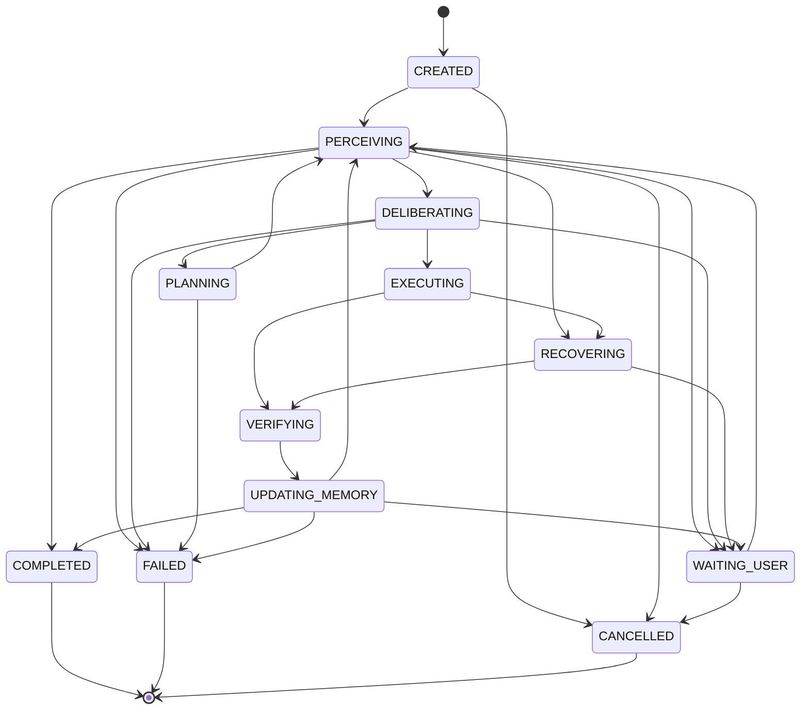

# NeuroLoop — Correções e Deltas sobre a Especificação do MVP

Documento de **delta** sobre `01_especificacao_mvp.md`. Não substitui a spec: corrige inconsistências internas, preenche schemas ausentes e ajusta pontos que impediriam medir a hipótese central.

Referências no formato `§N` apontam para seções de `01_especificacao_mvp.md`.

Cada correção segue o formato: **problema → decisão → impacto**.

---

## Índice das correções

| # | Correção | Seção afetada | Severidade |
|---|---|---|---|
| C01 | `Criterion` definido como união tipada | §24, §15 | Bloqueante |
| C02 | Verificação de goal exige baseline e evidência externa | §7, §15 | Bloqueante |
| C03 | `RunCheckpoint` unificado com limites e flags | §9, §7 | Bloqueante |
| C04 | Contagem de retry e `RETRY_LIMIT` alcançável | §7, §24 | Bloqueante |
| C05 | `RECOVERING` alcançável; `effect_probe` por tool | §7, §11, §14 | Bloqueante |
| C06 | State machine: estados mortos removidos, tabela completa | §8 | Alta |
| C07 | Ordem de replan e semântica de `max_replans` | §7 | Média |
| C08 | Durabilidade: fase derivada de attempt, não de `transition()` | §7, §23 | Alta |
| C09 | Escopo de idempotência vs. fingerprint | §14 | Alta |
| C10 | Taint de conteúdo não confiável → policy | §22, §20 | Alta |
| C11 | Lock de run com lease e fencing; papel do `state_version` | §23 | Alta |
| C12 | `LLMClient` devolve usage; contabilidade de budget | §21, §9 | Média |
| C13 | Fast Path: score definido, threshold corrigido | §12, §18 | Alta |
| C14 | `Episode.importance` com fórmula explícita | §16 | Média |
| C15 | Tabelas ausentes: `observations`, `skills` | §23 | Média |
| C16 | H3 / B5: mecanismo determinístico de reuso | §2, §30 | Alta |
| C17 | Oracle de benchmark independente do Verifier | §30, §31 | Bloqueante |
| C18 | Amostragem estatística das métricas | §31 | Média |
| C19 | Aprovação vinculada ao fingerprint da ação | §22 | Média |
| C20 | Stack: Python 3.13 | §26 | Baixa |
| C21 | Backlog reordenado com walking skeleton | §36 | Alta |

---

## C01 — `Criterion` definido como união tipada

**Problema.** `Criterion` é referenciado em `Goal.success_criteria`, `Goal.failure_criteria`, `PlanStep.preconditions`, `PlanStep.expected_outcomes` e `SkillDefinition.success_criteria`, mas nunca é definido em §24 nem consta da TASK-001. É o tipo que sustenta a promessa de verificação determinística — sem ele, "verificação objetiva" não tem implementação.

**Decisão.** `Criterion` é uma união discriminada por `kind`, avaliada por código determinístico, imutável e fechada a campos extras.

A origem da evidência (`observes`) **não é declarada — é derivada** por `effective_observes()`. Declará-la como campo permitiria estado inconsistente: um critério que lê o auto-relato da tool mas se anuncia como observador do estado externo passaria pela validação e furaria a regra de C02. Derivar elimina a classe inteira de erro.

```python
class _CriterionBase(BaseModel):
    model_config = ConfigDict(extra="forbid", frozen=True)
    negate: bool = False

Observes = Literal["EXTERNAL_STATE", "ACTION_RESULT", "RUN_STATE"]

def effective_observes(criterion: Criterion) -> Observes: ...
```

Regra de derivação:

| Critério | `observes` |
|---|---|
| `FileExists`, `FileMatchesJsonSchema`, `HttpStatusEquals`, `CommandExitCodeEquals` | `EXTERNAL_STATE` |
| `ValueEquals` | `RUN_STATE` |
| `JsonPathEquals`, `JsonPathCount` | `EXTERNAL_STATE` se `source="FILE"`, senão `ACTION_RESULT` |
| `AllOf`, `AnyOf` | evidência **mais fraca** entre os filhos (`ACTION_RESULT` < `RUN_STATE` < `EXTERNAL_STATE`) |

A regra do composto importa: um `AllOf` misturando releitura de arquivo com auto-relato da tool **não** produz prova externa e portanto não conclui goal.

Membros da V0:

```python
class FileExists(_CriterionBase):
    kind: Literal["FILE_EXISTS"] = "FILE_EXISTS"
    path: str

class FileMatchesJsonSchema(_CriterionBase):
    kind: Literal["FILE_MATCHES_JSON_SCHEMA"] = "FILE_MATCHES_JSON_SCHEMA"
    path: str
    json_schema: dict[str, Any]

class JsonPathEquals(_CriterionBase):
    kind: Literal["JSON_PATH_EQUALS"] = "JSON_PATH_EQUALS"
    source: Literal["FILE", "ACTION_RESULT"]
    json_path: str
    expected: Any = None
    path: str | None = None       # obrigatório quando source == "FILE"

class JsonPathCount(_CriterionBase):
    kind: Literal["JSON_PATH_COUNT"] = "JSON_PATH_COUNT"
    source: Literal["FILE", "ACTION_RESULT"]
    json_path: str
    expected_count: int = Field(ge=0)
    path: str | None = None

class ValueEquals(_CriterionBase):
    kind: Literal["VALUE_EQUALS"] = "VALUE_EQUALS"
    ref: str                      # resolvível no contexto de avaliação
    expected: Any = None

class HttpStatusEquals(_CriterionBase):
    kind: Literal["HTTP_STATUS_EQUALS"] = "HTTP_STATUS_EQUALS"
    method: Literal["GET", "HEAD"] = "GET"
    url: str
    expected_status: int = Field(ge=100, le=599)

class CommandExitCodeEquals(_CriterionBase):
    kind: Literal["COMMAND_EXIT_CODE_EQUALS"] = "COMMAND_EXIT_CODE_EQUALS"
    command: tuple[str, ...] = Field(min_length=1)
    expected_exit_code: int = 0

class AllOf(_CriterionBase):
    kind: Literal["ALL_OF"] = "ALL_OF"
    criteria: tuple["Criterion", ...] = Field(min_length=1)

class AnyOf(_CriterionBase):
    kind: Literal["ANY_OF"] = "ANY_OF"
    criteria: tuple["Criterion", ...] = Field(min_length=1)

Criterion = Annotated[
    FileExists | FileMatchesJsonSchema | JsonPathEquals | JsonPathCount
    | ValueEquals | HttpStatusEquals | CommandExitCodeEquals | AllOf | AnyOf,
    Field(discriminator="kind"),
]
```

Avaliação:

```python
class CriterionOutcome(BaseModel):
    criterion_kind: str
    satisfied: bool | None        # None == INDETERMINATE
    observed: Any | None
    expected: Any | None
    error: str | None
    observed_at: datetime

class CriterionEvaluator(Protocol):
    async def evaluate(self, criterion: Criterion, ctx: EvaluationContext) -> CriterionOutcome: ...
```

**Regra dura.** `satisfied=None` (INDETERMINATE) **nunca** conta como satisfeito. Um `AllOf` com qualquer `None` e nenhum `False` resulta `None`, não `True`. Um critério que não pôde ser observado é motivo para `RECOVER` ou `ASK_USER`, jamais para `GOAL_COMPLETED`.

**Impacto.** Torna TASK-001 e TASK-007 implementáveis. `Criterion` entra em TASK-001 (não em TASK-007), porque `Goal` depende dele.

---

## C02 — Verificação de goal exige baseline e evidência externa

**Problema.** §7 roda `verifier.verify_goal_if_possible` no topo de todo ciclo, inclusive na iteração 0, antes de qualquer ação. Um goal como *"gerar `/workspace/eligible.json` com 3 registros"* é declarado `COMPLETED` sem ação alguma se o arquivo já existir de um run anterior. Isso é precisamente o `false_success_rate` que §31 elege como métrica principal.

**Decisão.**

1. **Baseline no início do run.** Ao criar o run, avaliar todos os `success_criteria` e persistir o resultado como `run.baseline_outcomes`. Um critério já satisfeito no baseline é marcado `pre_satisfied=true`.
2. **Regra de conclusão.** Um goal só é `COMPLETED` se todos os `success_criteria` estiverem satisfeitos **e** pelo menos um critério não-`pre_satisfied` tiver transicionado de não-satisfeito para satisfeito durante o run. Caso contrário o resultado é `GOAL_PRE_SATISFIED`, que exige confirmação humana (`ASK_USER`), não conclusão automática.
3. **Só evidência externa conclui.** Goal verification aceita exclusivamente critérios com `observes="EXTERNAL_STATE"`. Critérios `ACTION_RESULT` servem para execution verification e expected outcomes de step, nunca para declarar o goal satisfeito. Um `Goal` cujos `success_criteria` não contenham nenhum critério `EXTERNAL_STATE` é rejeitado na criação com `INVALID_GOAL_CRITERIA`.
4. **Posição no loop.** A verificação de goal no topo do ciclo passa a rodar somente a partir da iteração 1 (após pelo menos uma ação verificada); na iteração 0 roda apenas a captura de baseline.

**Impacto.** Fecha o principal vetor de falso sucesso da spec. Adiciona `baseline_outcomes` ao checkpoint (ver C03) e o código de erro `GOAL_PRE_SATISFIED` à taxonomia.

---

## C03 — `RunCheckpoint` unificado

**Problema.** O loop de §7 lê `run.max_iterations`, `run.max_replans` e `run.cancel_requested`; nenhum dos três existe no `RunCheckpoint` de §9. `ExecutionBudget` (§24) existe sem dono declarado.

**Decisão.** `ExecutionBudget` é campo embutido do run (coluna JSONB, imutável após criação). Contadores e flags entram no checkpoint:

```python
class RunCheckpoint(BaseModel):
    run_id: UUID
    goal_id: UUID
    phase: RunPhase
    iteration: int

    active_plan_id: UUID | None
    active_plan_version: int | None
    current_step_id: str | None

    replan_count: int
    plan_generation_count: int          # inclui o plano inicial; ver C07
    retry_counts: dict[UUID, int]       # por logical_action_id; ver C04

    waiting_reason: str | None
    pending_approval_action_id: UUID | None
    pending_approval_fingerprint: str | None   # ver C19

    last_action_id: UUID | None
    last_verified_action_id: UUID | None
    unresolved_effect_action_id: UUID | None   # ver C05

    budget: ExecutionBudget             # imutável
    tokens_used: int
    cost_used_usd: Decimal

    baseline_outcomes: list[CriterionOutcome]  # ver C02
    cancel_requested: bool

    started_at: datetime
    wall_clock_deadline: datetime
    state_version: int
```

`limits_exceeded(run)` passa a ler exclusivamente de `run.budget` e dos contadores acima.

---

## C04 — Contagem de retry e `RETRY_LIMIT` alcançável

**Problema.** O `case "RETRY"` de §7 chama `schedule_retry_same_action` e faz `continue`, sem incrementar contador nem consultar limite. `RETRY_LIMIT` (§32) é inatingível. Além disso `retry_count` no checkpoint é por-run enquanto `max_retries_per_action` é por-ação.

**Decisão.** Retry é contado por `logical_action_id`, em `retry_counts: dict[UUID, int]`. O bloco corrigido:

```python
case "RETRY":
    attempts = run.retry_counts.get(action_record.logical_action_id, 0)
    if attempts >= run.budget.max_retries_per_action:
        return await fail_run(run, "RETRY_LIMIT", action_id=action_record.id)
    if not executor.retry_is_safe(action_record):
        return await wait_for_user(run, reason="RETRY_NOT_PROVABLY_SAFE")
    run.retry_counts[action_record.logical_action_id] = attempts + 1
    await checkpoint(run)
    await schedule_retry_same_action(action_record)
    continue
```

Ordem importa: o limite é checado **antes** da prova de segurança, e o incremento é persistido **antes** da nova tentativa — senão um crash entre incremento e execução perde a contagem e permite retry infinito através de restarts.

`retry_is_safe` continua exigindo idempotência declarada ou prova de ausência do efeito (§3).

---

## C05 — `RECOVERING` alcançável e `effect_probe` por tool

**Problema.** O gate do Controller (§11) prevê `if unresolved_uncertain_side_effect: RECOVER`, e §8 tem `EXECUTING → RECOVERING`, mas em §7 `policy.pre_decision` só devolve `STOP` e `WAIT_USER`, e não existe nenhuma transição para `RECOVERING`. O fluxo `UNKNOWN_EFFECT → probe → confirmado/ausente/indeterminável` (§3) — que é o diferencial da arquitetura — não tem implementação. Falta também o mecanismo do probe: `ToolDefinition` (§14) não declara como observar se o efeito ocorreu.

**Decisão.**

1. `ToolDefinition` ganha:

```python
    effect_probe: EffectProbe | None
```

```python
class EffectProbe(BaseModel):
    # Constrói um Criterion EXTERNAL_STATE a partir dos argumentos da ação
    # que foi executada, para responder: "o efeito existe agora?"
    criterion_template: Criterion
    argument_bindings: dict[str, str]   # placeholder no template -> caminho no arguments
```

Toda tool com `side_effects=True` **deve** declarar `effect_probe`; o `ToolRegistry` rejeita o registro caso contrário. Sem probe não existe recuperação possível, apenas `WAITING_USER`.

2. Quando `executor.execute` devolve `UNKNOWN_EFFECT`, o loop persiste `run.unresolved_effect_action_id` e entra em `RECOVERING`:

```python
transition(run, RECOVERING)
probe = await executor.probe_effect(action_record)
match probe.result:
    case "EFFECT_PRESENT":
        result = ToolResult.recovered_success(probe)
    case "EFFECT_ABSENT" if tool.supports_idempotency or not tool.side_effects:
        result = ToolResult.failed_safe_to_retry(probe)
    case _:
        return await wait_for_user(run, reason="AMBIGUOUS_EFFECT", action_id=action_record.id)
run.unresolved_effect_action_id = None
await checkpoint(run)
```

3. `policy.pre_decision` passa a devolver `RECOVER` quando `run.unresolved_effect_action_id` não é nulo — o que cobre o caso de crash: ao retomar, o run reentra em `RECOVERING` antes de qualquer nova deliberação.

**Impacto.** Torna B3 executável e liga `RECOVERING` ao loop. `filesystem.write` e `http.request` passam a exigir `effect_probe` no registry.

---

## C06 — State machine: estados mortos e tabela completa

**Problema.** `WAITING_EXTERNAL` não tem transição de entrada e seu scheduling é explicitamente V0.5 — sem scheduler, nada sai desse estado. `BLOCKED` não aparece em nenhuma transição. `PLANNING` está no diagrama mas o loop nunca entra nele. Nenhuma aresta leva a `CANCELLED`, apesar de `cancel_requested` poder disparar em qualquer topo de ciclo.

**Decisão.** V0 tem 12 estados. `WAITING_EXTERNAL` e `BLOCKED` saem do enum e voltam na V0.5 junto com o scheduler. `PLANNING` passa a ser efetivamente entrado.

```text
CREATED PERCEIVING DELIBERATING PLANNING EXECUTING VERIFYING
RECOVERING UPDATING_MEMORY WAITING_USER COMPLETED FAILED CANCELLED
```

Tabela de transições:

| De | Para | Guarda |
|---|---|---|
| CREATED | PERCEIVING | run iniciado; baseline capturado |
| CREATED | CANCELLED | `cancel_requested` |
| PERCEIVING | DELIBERATING | contexto construído; goal não satisfeito |
| PERCEIVING | COMPLETED | goal satisfeito com delta (C02), `iteration >= 1` |
| PERCEIVING | WAITING_USER | `GOAL_PRE_SATISFIED` |
| PERCEIVING | RECOVERING | `unresolved_effect_action_id` presente |
| PERCEIVING | FAILED | budget/loop limit |
| PERCEIVING | CANCELLED | `cancel_requested` |
| DELIBERATING | PLANNING | decisão `PLAN` |
| DELIBERATING | EXECUTING | decisão `ACT` autorizada |
| DELIBERATING | WAITING_USER | `ASK_USER` ou aprovação requerida |
| DELIBERATING | FAILED | `IMPOSSIBLE`, `PERMISSION_DENIED` |
| PLANNING | PERCEIVING | plano válido persistido |
| PLANNING | FAILED | `INVALID_PLAN`, `REPLAN_LIMIT` |
| EXECUTING | VERIFYING | resultado definido (sucesso ou falha) |
| EXECUTING | RECOVERING | `UNKNOWN_EFFECT` |
| RECOVERING | VERIFYING | probe conclusivo |
| RECOVERING | WAITING_USER | probe indeterminável |
| VERIFYING | UPDATING_MEMORY | sempre |
| UPDATING_MEMORY | PERCEIVING | `CONTINUE`, `RETRY`, `REPLAN` |
| UPDATING_MEMORY | COMPLETED | `GOAL_COMPLETED` |
| UPDATING_MEMORY | FAILED | `STOP_FAILURE` |
| UPDATING_MEMORY | WAITING_USER | `ASK_USER` |
| WAITING_USER | PERCEIVING | evento de resume |
| WAITING_USER | CANCELLED | `cancel_requested` |

Estados terminais: `COMPLETED`, `FAILED`, `CANCELLED` — sem transição de saída. Qualquer tentativa de transição a partir deles levanta `STATE_CONFLICT`.



---

## C07 — Ordem de replan e semântica de `max_replans`

**Problema.** Em §7 o plano ativo é substituído **antes** da checagem de limite, e o primeiro plano conta como replan — `max_replans=3` entrega na prática 1 plano inicial + 2 replans.

**Decisão.** Separar `plan_generation_count` (total, inclui o inicial) de `replan_count` (substituições de plano ativo). Checar antes de mutar:

```python
if decision.type == "PLAN":
    is_replan = run.active_plan_id is not None
    if is_replan and run.replan_count + 1 > run.budget.max_replans:
        return await fail_run(run, "REPLAN_LIMIT")
    transition(run, PLANNING)
    plan = planner_validator.validate(decision.plan)   # levanta INVALID_PLAN
    await plans.replace_active(run.id, plan)
    run.plan_generation_count += 1
    if is_replan:
        run.replan_count += 1
    await checkpoint(run)
    continue
```

`max_replans=3` passa a significar 1 plano inicial + 3 replanejamentos.

---

## C08 — Durabilidade: fase derivada de attempt

**Problema.** `transition()` é síncrono e o `checkpoint()` vem depois; entre `transition(run, EXECUTING)` e a chamada da tool não há persistência. Os testes de recovery de §29 ("crash durante a tool") dependem exatamente dessa janela. A state machine, como escrita, não sobrevive a crash.

**Decisão.**

1. `transition()` é mutação **em memória**; a fase persistida só é confiável após `checkpoint()`.
2. O marcador durável de execução é a linha em `action_attempts`, gravada e commitada **antes** da chamada externa, contendo `logical_action_id`, `idempotency_key`, `action_fingerprint`, `started_at`, `status=IN_FLIGHT`.
3. Na retomada, a fase é **derivada**, não lida:

```text
existe attempt IN_FLIGHT  → RECOVERING (probe obrigatório antes de qualquer decisão)
senão, phase == EXECUTING → RECOVERING (crash entre checkpoint e attempt: nada foi enviado,
                                        mas é preciso provar)
senão                     → phase do checkpoint
```

4. Nunca manter transação aberta durante chamada externa (já em §7): o commit do attempt fecha antes da chamada; a atualização para `SUCCESS`/`FAILED`/`UNKNOWN` é uma segunda transação.

**Impacto.** Os quatro cenários de recovery de §29 passam a ter comportamento definido. `run_events` continua sendo tracing, não fonte de verdade.

---

## C09 — Escopo de idempotência vs. fingerprint

**Problema.** §14 define `action_fingerprint = hash(tool_version + canonical_json(arguments) + target_resource)` sem escopo. Se usado para dedup entre runs, ações legitimamente repetidas (escrever o mesmo arquivo em dois steps) são falsamente deduplicadas. A spec também não diz explicitamente que o retry reusa a mesma chave.

**Decisão.** Dois identificadores com propósitos disjuntos:

```text
idempotency_key = hash(run_id + logical_action_id)
    → semântica at-most-once do efeito externo
    → CONSTANTE entre tentativas da mesma ação lógica (é o que torna o retry seguro)
    → enviado ao serviço externo quando a tool suporta

action_fingerprint = hash(tool_name + tool_version + canonical_json(arguments) + target_resource)
    → detecção de loop DENTRO do run
    → NÃO deduplica execução; alimenta LOOP_DETECTED
```

Regra de loop: mesmo `action_fingerprint` observado `>= 3` vezes no run **sem** mudança em `last_verified_action_id` entre elas → `LOOP_DETECTED`. Repetição com progresso verificado entre as ocorrências é legítima e não dispara.

---

## C10 — Taint de conteúdo não confiável

**Problema.** `Observation.trust` existe e nada o consome. A fórmula de salience de §20 não tem termo de trust. O `PolicyEngine` não liga origem-do-dado a risco-da-ação. B4 (prompt injection) testa um princípio sem mecanismo.

**Decisão.**

1. **Propagação.** `ActionProposal` ganha `derived_from: list[UUID]` — ids das observações que originaram seus argumentos. O `Deliberator` é obrigado por schema a preenchê-lo; um `ACT` com argumento não vazio e `derived_from=[]` é rejeitado como `TOOL_VALIDATION_ERROR`.
2. **Regra de policy.** Se qualquer observação em `derived_from` tem `trust="UNTRUSTED_EXTERNAL"` e `action.risk >= R1`, então: `requires_user_approval=True`. Se `risk >= R2`, `allowed=False` com `PROMPT_INJECTION`.
3. **Recursos.** Argumentos de caminho/URL derivados de conteúdo não confiável são validados contra a allowlist do sandbox **antes** da autorização, com resolução de path canônica (`..`, symlink, UNC).
4. **Salience.** O termo de trust entra como penalidade, não como bônus:

```text
salience = 0.35*goal_relevance + 0.25*risk + 0.20*recency
         + 0.10*novelty + 0.10*unresolved
         - 0.15*(trust == UNTRUSTED_EXTERNAL)
```

5. **Renderização.** Conteúdo `UNTRUSTED_EXTERNAL` entra no prompt dentro de um envelope delimitado e explicitamente rotulado como dado inerte, jamais concatenado ao bloco de instruções.

---

## C11 — Lock de run com lease e fencing

**Problema.** `acquire_run_lock` envolve o loop inteiro, incluindo tools com `wall_clock_seconds: 900`. Se for advisory lock em conexão, ela fica presa durante toda a execução; se o processo morrer, não há expiração definida. E com lock exclusivo, `state_version` é redundante.

**Decisão.**

1. Lock é uma **lease** em linha de tabela (`agent_runs.lease_owner`, `lease_expires_at`, `lease_epoch`), não advisory lock em conexão.
2. TTL de 60s, renovado por heartbeat a cada 20s no topo do ciclo e antes de toda chamada externa longa.
3. `lease_epoch` incrementa a cada aquisição e funciona como **fencing token**: toda escrita de checkpoint carrega o epoch; escrita com epoch desatualizado falha com `STATE_CONFLICT`. Isso protege contra o caso do processo pausado que volta após a lease expirar.
4. `state_version` permanece como optimistic lock das escritas de checkpoint — é o mecanismo que detecta o conflito; a lease é o que evita que dois runners cheguem lá.
5. Se a lease expira com attempt `IN_FLIGHT`, o novo dono entra obrigatoriamente em `RECOVERING` (C08).

---

## C12 — `LLMClient` devolve usage

**Problema.** `limits_exceeded` depende de `tokens_used` e `cost_used_usd`, e o protocolo `LLMClient` não expõe consumo. Ninguém escreve esses campos.

**Decisão.**

```python
class LLMUsage(BaseModel):
    input_tokens: int
    output_tokens: int
    cached_input_tokens: int = 0
    cost_usd: Decimal
    model: str
    model_version: str

class LLMResponse(BaseModel, Generic[T]):
    output: T
    usage: LLMUsage

class LLMClient(Protocol):
    async def structured(self, *, messages, output_schema, model_profile) -> LLMResponse: ...
```

Toda chamada credita `run.tokens_used` e `run.cost_used_usd` no checkpoint do ciclo. O core continua sem conhecer SDK de provider: o cálculo de `cost_usd` fica na camada adapter, a partir de uma tabela de preços versionada.

---

## C13 — Fast Path: score definido, threshold corrigido

**Problema.** `skill_match.score >= 0.95` sem definição do scorer. Sem embeddings na V0 e com matching por `trigger_tags`, o score é overlap discreto de conjuntos pequenos — na prática vira match exato, ou o threshold não significa nada. Consequência: `fast_path_hit_rate ≈ 0` e o alvo `fast_path_success_rate > 95%` fica sobre denominador vazio.

**Decisão.** Duas fontes de Fast Path, com critérios distintos:

**(a) PlanStep materializado** — caminho principal e determinístico. Elegível quando o step tem `preferred_tool` e `arguments` completos, `preconditions` satisfeitas e `risk <= R1`. Não usa score. É daqui que virá a maior parte do `fast_path_hit_rate` na V0.

**(b) Skill match** — score explícito, sem ML:

```text
score = 0.60 * jaccard(goal_tags ∪ observation_tags, skill.trigger_tags)
      + 0.40 * (required_inputs_resolvidos / |required_inputs|)

elegível se score >= 0.75
         and required_inputs_resolvidos == |required_inputs|
         and skill.enabled
         and skill.version_is_valid
         and action.risk <= R1
         and todas preconditions satisfeitas
         and nenhuma falha não resolvida no run
```

O segundo termo é binário na prática (argumentos completos são obrigatórios), então o threshold efetivo é `jaccard >= 0.58`, alcançável com tag sets pequenos.

**Métricas.** `fast_path_hit_rate` e `fast_path_success_rate` passam a ser reportadas separadas por fonte (`STEP` e `SKILL`); o alvo de 95% aplica-se a cada uma, e a métrica é reportada como indefinida quando o denominador for menor que 20.

---

## C14 — `Episode.importance`

**Problema.** `importance` alimenta o ranking do retrieval e nunca é calculado.

**Decisão.** Calculado na gravação, determinístico, sem LLM:

```text
importance = 0.35 * (verificação falhou ou execution_status != SUCCESS)
           + 0.25 * normalize(action.risk)
           + 0.20 * (decision_type in {PLAN, ASK_USER})
           + 0.10 * (error_code is not None)
           + 0.10 * (episódio pertence ao ciclo que concluiu o goal)
```

Ranking de retrieval: `0.5*match_estrutural + 0.3*importance + 0.2*recency_decay`, onde `match_estrutural` é o overlap de tags/tool/error_code/resource já previsto em §16.

Racional: episódios de falha e de decisão custosa carregam mais informação reutilizável que episódios de sucesso trivial.

---

## C15 — Tabelas ausentes

**Problema.** §23 lista 8 tabelas e omite `observations` (`perception.collect_pending(run)` pressupõe persistência) e `skills` (cadastradas manualmente, precisam de armazenamento).

**Decisão.** Conjunto V0:

```text
agents
goals
agent_runs          (+ budget JSONB, lease_owner, lease_expires_at, lease_epoch, baseline_outcomes JSONB)
observations        (+ trust, content_hash, consumed_at)
plans               (steps como JSONB; sem tabela plan_steps na V0)
actions             (logical_action_id, idempotency_key, action_fingerprint, derived_from)
action_attempts     (status IN_FLIGHT|SUCCESS|FAILED|UNKNOWN, started_at, finished_at)
episodes
skills              (versionadas, enabled, stats)
run_events          (tracing/auditoria)
```

Índices mínimos: `observations(run_id, consumed_at)`, `actions(run_id, action_fingerprint)`, `action_attempts(status) WHERE status='IN_FLIGHT'`, `episodes(run_id, iteration)`, `episodes` GIN em `tags`.

---

## C16 — H3 / B5: mecanismo determinístico de reuso

**Problema.** Fast Path não aprende, skills são manuais, memória semântica é V0.5. O único mecanismo de reuso é injetar top-5 episódios no prompt do Deliberator — ou seja, a redução de ciclos do B5 depende inteiramente de o LLM ler episódios e planejar melhor. Isso é alta variância e é justamente o mecanismo que a arquitetura desconfia; medir `memory_reuse_gain` assim produz ruído.

**Decisão.** Adicionar um mecanismo determinístico e auditável, sem sair do escopo da V0:

**Plan cache.** Ao concluir um run com sucesso, gravar o plano executado indexado por `goal_fingerprint = hash(canonical(success_criteria) + tool_set_usado)`. Em um novo run, se existe entrada com `goal_fingerprint` idêntico e taxa de sucesso histórica ≥ 0.8, o plano é **proposto ao PlannerValidator** como candidato — revalidado integralmente (DAG, tools existentes, preconditions, risco), nunca executado às cegas.

Isso mantém a divisão de responsabilidades: o cache propõe, o validador autoriza, o Verifier decide a conclusão. E torna H3 falsificável — a economia de ciclos passa a ser atribuível a um mecanismo inspecionável, com `plan_cache_hit_rate` medível.

`memory_reuse_gain` é reportado separando as duas vias: `via_plan_cache` e `via_episode_context`.

---

## C17 — Oracle de benchmark independente

**Problema.** §37 alerta sobre o Verifier correlacionar com a alucinação do LLM, mas o risco maior é de código: se o oracle do harness avalia `Criterion` com a mesma implementação do Verifier, B2 (false success trap) é auto-confirmatório e `false_success_rate` mede zero por construção.

**Decisão.**

1. O oracle de cada benchmark é escrito como **asserção direta e específica** do cenário (ler o arquivo, contar registros, checar o mock da API), sem importar nada de `neuroloop.verification`.
2. Regra de dependência verificada em teste: `tests/benchmarks/` não pode importar o módulo de avaliação de critérios. Um teste de arquitetura falha o build se importar.
3. Os oracles são escritos **antes** do Verifier (ver C21) — assim não há como espelhar a implementação.
4. B2 especifica explicitamente a divergência: `filesystem.write` reporta sucesso mas grava conteúdo truncado; o oracle checa o conteúdo real.
5. B3 exige que a API fake do harness honre `Idempotency-Key` e exponha um endpoint de contagem de recursos — sem isso o benchmark não é executável (§38 já admite que exactly-once não é garantível em API arbitrária).

---

## C18 — Amostragem das métricas

**Problema.** `false_success_rate < 1%` não é mensurável com 5 execuções.

**Decisão.** Cada benchmark roda com N seeds (padrão 30) variando ordem de falhas injetadas e conteúdo. Métricas reportadas com intervalo de confiança de Wilson 95%. Alvos passam a ser formulados sobre o limite superior do intervalo:

```text
false_success_rate:        limite superior 95% < 5% com N=30  (alvo <1% exige N≈300, fica para V0.5)
duplicate_side_effect_rate: 0 ocorrências em N=30            (hard fail se qualquer ocorrência)
unauthorized_execution_rate: 0 ocorrências em N=30           (hard fail)
tool_failure_recovery_rate: > 90%
```

Métrica com denominador < 20 é reportada como indefinida, não como percentual.

---

## C19 — Aprovação vinculada ao fingerprint

**Problema.** Aprovação humana é vinculada a `action_id`. Entre pedir e aprovar, o run pode ser retomado com argumentos diferentes para a mesma ação lógica — confused deputy.

**Decisão.** `pending_approval_fingerprint` é gravado junto com o pedido. No resume, se `action_fingerprint` recalculado difere do aprovado, a aprovação é invalidada e um novo pedido é emitido. Aprovação também expira com o `wall_clock_deadline` do run.

---

## C20 — Stack: Python 3.13

**Decisão.** Python 3.13 em vez de 3.14. Motivo: é o que está disponível no ambiente de desenvolvimento e nada na spec depende de recurso exclusivo do 3.14. Sem impacto arquitetural.

Demais itens de §26 mantidos: FastAPI, Pydantic v2, SQLAlchemy 2.x, Alembic, PostgreSQL, psycopg 3, SDK direto do provider, OpenTelemetry, pytest, Docker Compose. Sem LangGraph na V0.

---

## C21 — Backlog reordenado com walking skeleton

**Problema.** Na ordem original nada roda ponta-a-ponta até a TASK-012, empurrando todo o risco de integração para o fim.

**Decisão.** Inserir um walking skeleton cedo e mover os oracles para antes do Verifier (C17):

| # | Task | Nota |
|---|---|---|
| 1 | TASK-001 Core schemas | **inclui `Criterion` e `CriterionOutcome`** (C01) |
| 2 | TASK-002 State machine | 12 estados, tabela de C06 |
| 3 | TASK-003 PostgreSQL persistence | tabelas de C15; lease + fencing (C11) |
| 4 | TASK-004 Tool Registry | `effect_probe` obrigatório para side effects (C05) |
| 5 | **TASK-004.5 Walking skeleton** | **novo**: goal → `filesystem.read` → 1 `Criterion` → COMPLETED, com fake LLM e sem policy. Objetivo é fechar o circuito e expor risco de integração agora. |
| 6 | TASK-005 Policy Engine | R0–R3, sandbox, taint de C10 |
| 7 | TASK-006 Durable Executor | attempt antes da chamada (C08), idempotência (C09), probe (C05) |
| 8 | **TASK-006.5 Benchmark oracles** | **movida para cá**: oracles de B1–B5 escritos antes do Verifier (C17) |
| 9 | TASK-007 Verifier | 4 níveis, baseline e delta (C02) |
| 10 | TASK-008 Episodic Memory | `importance` de C14 |
| 11 | TASK-009 Workspace Builder | salience com termo de trust (C10) |
| 12 | TASK-010 LLM adapter + Deliberator | `LLMResponse` com usage (C12) |
| 13 | TASK-011 Planner + Fast Path | scoring de C13; plan cache de C16 |
| 14 | TASK-012 Agent Runtime | loop completo com C04, C05, C07 |
| 15 | TASK-013 API / Human intervention | aprovação com fingerprint (C19) |
| 16 | TASK-014 Observability | |
| 17 | TASK-015 Benchmark harness | N seeds e Wilson (C18) |

---

## Adições à taxonomia de falhas

```text
GOAL_PRE_SATISFIED          goal já satisfeito no baseline; exige confirmação humana
INVALID_GOAL_CRITERIA       goal sem nenhum critério EXTERNAL_STATE
INDETERMINATE_VERIFICATION  critério não observável; nunca conta como sucesso
LEASE_LOST                  fencing token desatualizado
```

---

## Gaps de §38 que permanecem abertos

Sem alteração — continuam válidos como perguntas de pesquisa: suficiência do retrieval SQL sem embeddings, horizonte ideal de planejamento, suficiência de um único Deliberator, limite do Fast Path, verificação de objetivos semanticamente vagos, impossibilidade de exactly-once em APIs arbitrárias, e o momento de migrar para um durable workflow framework.

C16 reduz parcialmente o item 1 (parte do reuso deixa de depender de retrieval semântico), e C17 torna o item 5 mensurável ao forçar oracle independente.
