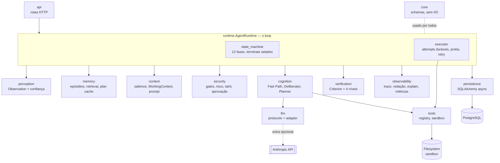
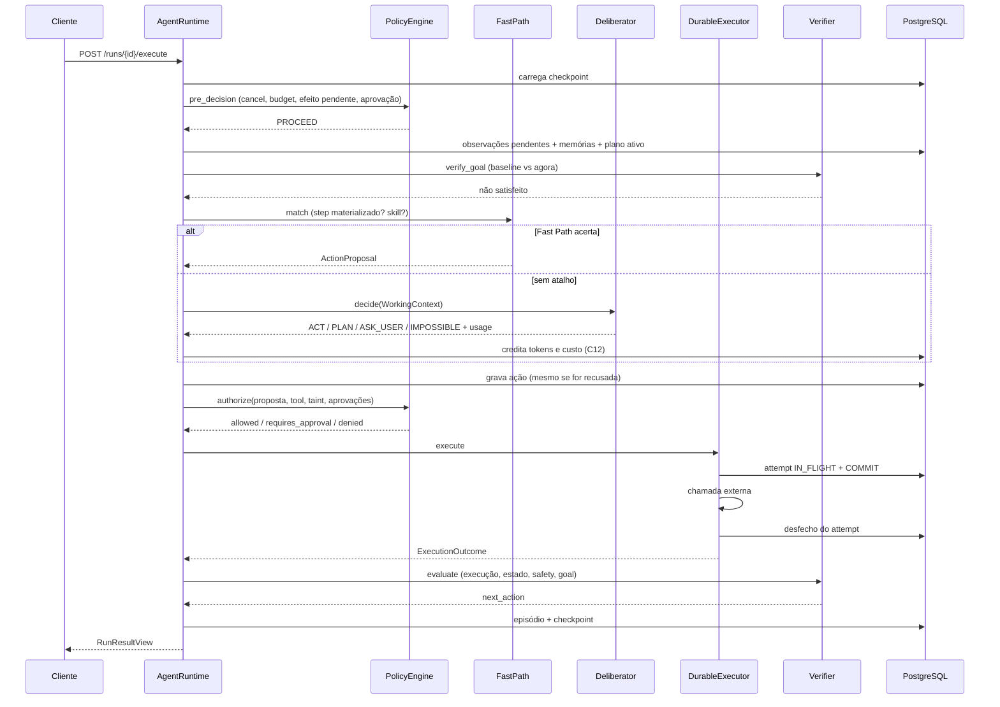

# Arquitetura

Este documento descreve o que existe no código. A especificação conceitual está em
[`01_especificacao_mvp.md`](../01_especificacao_mvp.md) e os desvios deliberados em
relação a ela em [`02_correcoes_spec.md`](../02_correcoes_spec.md) — as referências
`C01`…`C21` abaixo apontam para esse segundo documento.

## Ideia estruturante

O agente não é o LLM. O agente é o loop. O LLM entra em um único ponto — o
`Deliberator` — e sua saída atravessa três portas antes de virar ação: schema do
provider, tradução para o domínio e validação semântica contra o mundo real.

Quatro regras de separação, verificadas por teste:

```
Executor não decide.    Planner não executa.
Verifier não planeja.   LLM não autoriza.
```

## Componentes



| Módulo | Responsabilidade | Não faz |
|---|---|---|
| `core` | Schemas compartilhados e funções puras: `Criterion`, `Goal`, `Plan`, `ActionProposal`, `VerificationResult`, `RunCheckpoint`, identidade de ações. | I/O, LLM, persistência. |
| `perception` | Converte entradas heterogêneas em `Observation` e **atribui confiança** na entrada. | Interpretar conteúdo. |
| `context` | Ordena por salience, monta o `WorkingContext` limitado e renderiza o prompt. | Decidir. |
| `cognition` | `FastPath` (fontes STEP e SKILL), `Deliberator` (Controller + Planner numa chamada), `PlannerValidator`, skills. | Autorizar, executar. |
| `llm` | Protocolo `LLMClient`, schema achatado de saída, tradução para o domínio, adapter Anthropic, cliente falso. | Conhecer o runtime. |
| `tools` | Catálogo tipado e versionado, validação de argumentos por JSON Schema, sandbox de filesystem. | Autorizar. |
| `security` | Gates determinísticos e autorização por ação: capabilities, risco, recursos, taint, aprovação. | Executar. |
| `verification` | Avaliação de `Criterion` e Verifier de quatro níveis. | Planejar. |
| `memory` | Episódios com importância, retrieval top-k sem embeddings, plan cache. | Decidir. |
| `runtime` | State machine, executor durável e o loop que dirige tudo. | Decidir sozinho. |
| `persistence` | Modelos, sessão async, repositórios, lease e optimistic locking. | Semântica cognitiva. |
| `observability` | Identidade de trace, spans, redação, explicação de decisão, métricas. | Alterar comportamento. |
| `api` | Rotas HTTP e contratos de entrada/saída. | Decidir. |

## Fluxo de um ciclo



## Decisões técnicas e trade-offs

### O commit no meio da execução

`DurableExecutor` grava o attempt como `IN_FLIGHT` e **commita antes** da chamada
externa. Custo: uma transação a mais por ação. Benefício: após um crash existe registro
de que um efeito pode ter saído. Sem isso o retry seguinte vira duplicação silenciosa
(C08).

A fase de retomada é **derivada** desse registro, não lida do checkpoint: attempt em
voo ou fase `EXECUTING` forçam `RECOVERING`, e ação executada sem verificação força
`VERIFYING`.

### Duas identidades para uma ação (C09)

| Identificador | Função | Comportamento no retry |
|---|---|---|
| `idempotency_key` | at-most-once do efeito externo | **constante** entre tentativas |
| `action_fingerprint` | detecção de loop dentro do run | igual para a mesma ação |

Confundir os dois produz um de dois bugs: retry que duplica efeito, ou ações legítimas
repetidas suprimidas em silêncio. O retry de um step reusa a mesma ação lógica, o que
mantém a chave estável e faz o contador de retry acumular.

### Lease com fencing em vez de advisory lock

Um run pode executar por até 900 s. Segurar uma conexão do banco durante todo esse
tempo é inviável, então a exclusão mútua é uma **lease** em linha de tabela com TTL de
60 s. O `lease_epoch` é o fencing token: uma escrita com epoch antigo é rejeitada mesmo
com `state_version` correto — cobre o processo pausado que volta depois de outro runner
assumir (C11).

Trade-off: exige heartbeat e torna possível, em teoria, dois runners momentaneamente
ativos. O fencing token converte esse caso em erro detectado, não em corrupção.

### Schema achatado na fronteira do LLM (TASK-010)

Structured outputs não aceitam schema recursivo, e `Criterion` é recursivo por causa de
`AllOf`/`AnyOf`. Também não aceitam objeto de forma livre, o que exclui
`arguments: dict[str, Any]`.

A resposta foi um schema **estritamente menor** que o domínio: o modelo escreve lista
de critérios folha (a lista é a conjunção) e argumentos como string JSON, decodificados
e validados na tradução. Trade-off: uma camada de conversão a mais. Ganho: a superfície
que o modelo pode produzir é menor que a que o sistema aceita.

### Lógica ternária em toda a verificação (C01)

`satisfied` é `True`, `False` ou `None`. `None` significa "não foi possível observar" e
**nunca** conta como sucesso, em nenhuma composição. Tratar "não sei" como "não" produz
replanejamento espúrio; como "sim", produz falso sucesso. São erros distintos e caros.

### Conclusão exige delta (C02)

Um goal satisfeito antes do run começar não foi cumprido por este run. O baseline é
capturado na iteração 0 e a conclusão exige que ao menos um critério tenha transicionado
de não-satisfeito para satisfeito. Caso contrário o desfecho é `GOAL_PRE_SATISFIED`, que
pede confirmação humana.

### Taint como propagação, não como princípio (C10)

`Observation.trust` é atribuído na percepção a partir de uma **declaração da tool**
(`returns_external_content`), não de heurística. `ActionProposal.derived_from` carrega a
proveniência, e o `PolicyEngine` aplica:

| Origem | R0 | R1 | R2+ |
|---|---|---|---|
| confiável | automático | automático | aprovação |
| `UNTRUSTED_EXTERNAL` | automático | aprovação | `PROMPT_INJECTION` |

Proveniência que não se pode auditar conta como não confiável. Em paralelo, o conteúdo
externo entra no prompt dentro de um envelope sanitizado. São duas camadas
independentes — nenhuma delas "resolve" prompt injection, e é por isso que existem duas.

### Retrieval sem embeddings (C14)

Pré-filtro em SQL, ranking em Python:
`0.5·match_estrutural + 0.3·importância + 0.2·recência`. Comparar tags exigiria
containment em JSON, e não há forma portátil disso entre `jsonb ?|` no PostgreSQL e
`json_each` no SQLite.

Afinidade estrutural é **porta**, não apenas peso: sem nenhuma dimensão em comum o
episódio não entra, por mais recente ou importante que seja.

### Oracle de benchmark isolado por regra (C17)

`tests/benchmarks/oracles.py` não importa nada de `neuroloop` — só stdlib e SQLAlchemy,
com SQL cru. A regra é binária e verificada por AST em
`tests/benchmarks/test_oracle_independence.py`. Se o oracle avaliasse critérios com a
mesma implementação do Verifier, o `false_success_rate` mediria zero por construção.

### Persistência não conhece o runtime

Duas tentativas de inverter essa dependência produziram ciclos de import: o repositório
de eventos recebia `TransitionRecord` e o de runs chamava `derive_resume_phase`. Hoje os
repositórios devolvem fatos (`ResumeState` com flags) e o runtime traduz.

## Persistência

Onze tabelas, criadas por `migrations/0001_initial_schema.py` e
`0002_plan_cache.py`:

| Tabela | Papel |
|---|---|
| `agents`, `goals` | Identidade e objetivo. |
| `agent_runs` | Run + checkpoint na mesma linha, com budget, lease e baseline. |
| `observations` | Entradas percebidas, com confiança e marca de consumo. |
| `plans` | Plano ativo com steps em JSON; não há tabela `plan_steps`. |
| `actions` | Uma linha por intenção, com as duas identidades e a proveniência. |
| `action_attempts` | Marcador durável por tentativa; `IN_FLIGHT` é o sinal de recuperação. |
| `episodes` | Memória episódica com importância e tags. |
| `skills` | Memória procedural versionada. |
| `plan_cache` | Plano bem-sucedido indexado por assinatura do objetivo. |
| `run_events` | Tracing e auditoria. Não é event sourcing: nada é reconstruído daqui. |

Campos JSON usam `JSONB` no PostgreSQL e `JSON` nos demais dialetos. `UtcDateTime`
normaliza datetimes para UTC tz-aware na ida e na volta — sem isso, dialetos que não
guardam offset devolvem valores *naive* e a comparação com `datetime.now(UTC)` falha em
runtime.

## Observabilidade

Todo evento carrega `trace_id`, `cycle_id`, `iteration`, `phase` e `state_version`, mais
fingerprints das versões em vigor (modelo, registry de tools, policy, skills). Os spans
seguem a árvore da especificação e são gravados como `run_events`, junto da auditoria.

Redação acontece na **fronteira de saída** do tracer, não em cada call site: chain of
thought e segredos não entram, e a filtragem é por chave e por forma.

`observability/explain.py` reconstrói por que cada ação aconteceu juntando ação,
autorização, tentativas, verificação e contexto. Não há tabela nova — se uma explicação
sai incompleta, a lacuna está no que o runtime registra.

## Limites conhecidos

- **Sem entrada de servidor.** `create_app` é fábrica; não há objeto ASGI pronto.
- **Adapter Anthropic nunca exercitado contra a API real.** Todos os testes usam
  `FakeLLMClient`.
- **Benchmarks rodam em SQLite**, um mundo por seed. O runtime é verificado contra
  PostgreSQL pela suíte de integração.
- **`false_success_rate` com N=30** produz limite superior de 11% no intervalo de
  Wilson; o alvo de 1% da especificação exigiria cerca de 300 execuções.
- **Escopo V0**: sem memória semântica, sem consolidação, sem scheduler. As fases
  `WAITING_EXTERNAL` e `BLOCKED` foram removidas do enum por não terem aresta (C06).
